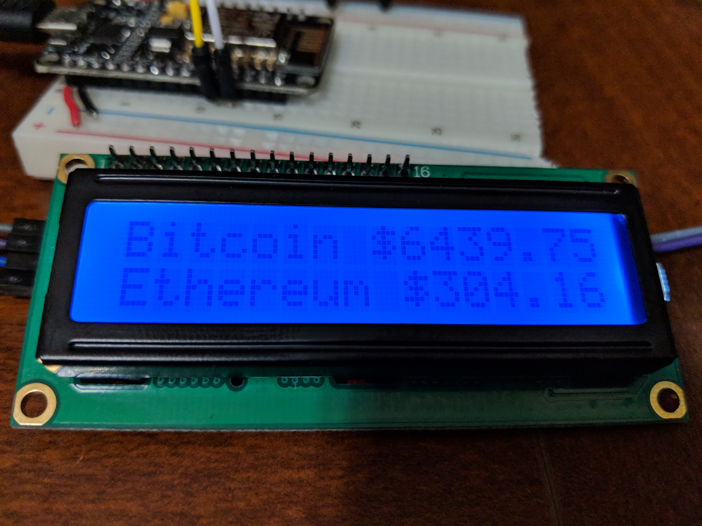
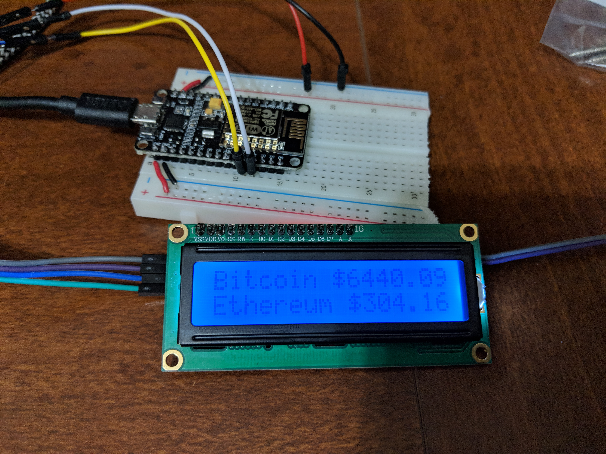

# ESP8266-CryptoTracker
Track the latest crypto prices via your esp8266

 

## How To Use
Wire up your esp8266 with a spare lcd screen. The project is configured to fetch prices via the Cryptocompare API. 

In the config.h set up which crypto you are interested in tracking.
```c
char *arrCoins[2][3] = {{"BTC", "Bitcoin","0"},{"ETH", "Ethereum", "1"}};
```
Then set your desired refresh time, in seconds.
```c
int delaySecs = 15;
```
And the currency.
```c
String currency = "USD";
```
Then power up the system and you're all set. Enjoy!
